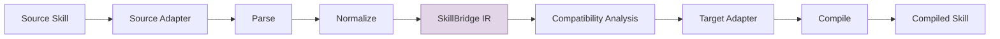

# SkillBridge

**Write an AI skill once. Run it anywhere.**

[](./LICENSE)
[](.nvmrc)
[](./CONTRIBUTING.md)

SkillBridge is a vendor-neutral interoperability layer for AI-agent skills. It converts skills written for one agent ecosystem (Claude Code, OpenAI Codex, OpenCode, etc.) into formats usable by others — without creating a separate converter for every pair.

> **Alpha notice:** SkillBridge v0.1.0-alpha is feature-complete for its initial scope but pre-1.0. APIs may change. See [known limitations](./docs/known-limitations.md).

---

## Problem

Every AI coding agent has its own skill format. Claude Code uses `CLAUDE.md`, OpenAI Codex uses `SKILL.md` with companion YAML, OpenCode uses structured markdown, and the open ecosystem uses plain `SKILL.md`. Converting between these formats today requires N×M pairwise converters — one for each source-target pair.

## Solution

SkillBridge uses a **vendor-neutral Intermediate Representation (IR)**. Every conversion flows through the IR, reducing N×M converters to N source adapters + M target adapters:



No direct pairwise converters. All conversions pass through the shared IR.

### Supported Adapters

| Adapter      | Source Format | Detect | Parse | Normalize | Compile | Install | Verify |
| ------------ | ------------- | ------ | ----- | --------- | ------- | ------- | ------ |
| Portable     | `markdown`    | ✅     | ✅    | ✅        | ✅      | —       | —      |
| Claude Code  | `markdown`    | ✅     | ✅    | ✅        | ✅      | ✅      | ✅     |
| OpenAI Codex | `markdown`    | ✅     | ✅    | ✅        | ✅      | ✅      | ✅     |
| OpenCode     | `markdown`    | ✅     | ✅    | ✅        | ✅      | ✅      | ✅     |

### Implemented Capabilities

- SKILL.md parsing with YAML frontmatter, body sections, diagnostic output
- SkillBridge IR normalization and validation
- Capability comparison across 22 capability types (8 categories)
- Compatibility analysis with 6 levels (native, emulated, missing, degraded, partial, unknown)
- Security-impact assessment (permission weakening detection)
- Policy enforcement (strict / safe / permissive modes)
- Deterministic compilation with staging, rollback, checksums
- Cross-adapter conversion (any source → any target through IR)
- CLI with 13 subcommands: convert, compile, parse, validate, inspect, adapters, capabilities, doctor, install, uninstall, list, verify, repair
- Dry-run preview for conversions and installs
- JSON output for all commands
- Docker-free, cloud-free, API-free local operation

### Known Limitations

- `invoke()` is a placeholder in all adapters (requires external runtime)
- Claude/Codex adapters default to permissive capabilities when no tools specified
- Only `markdown` source/target format is currently implemented
- YAML body-section parsing emits warnings for non-YAML section content
- No Windows CI runner (CI runs on Ubuntu only)
- See [full known limitations](./docs/known-limitations.md) for details

---

## Getting Started

### Prerequisites

- **Node.js 20** or newer (`.nvmrc` config provided)
- **pnpm** ([install guide](https://pnpm.io/installation)) — version 11.17.0 recommended

### Quick Start

```bash
# Clone and install
git clone https://github.com/skillbridge/skillbridge.git
cd skillbridge
pnpm install

# Run full verification
pnpm verify

# Parse an example skill
node apps/cli/dist/index.js parse packages/testing/fixtures/examples/hello-world/SKILL.md

# Convert between formats (dry-run)
node apps/cli/dist/index.js convert packages/testing/fixtures/examples/hello-world/SKILL.md \
  --policy permissive --dry-run

# List available adapters
node apps/cli/dist/index.js adapters --detail
```

### CLI Commands

| Command        | Description                            |
| -------------- | -------------------------------------- |
| `convert`      | Convert a skill between vendor formats |
| `compile`      | Compile a skill package                |
| `parse`        | Parse and display SKILL.md structure   |
| `validate`     | Validate a skill package               |
| `inspect`      | Show full skill metadata               |
| `adapters`     | List registered adapters               |
| `capabilities` | Display IR capability vocabulary       |
| `doctor`       | Run environment diagnostics            |
| `install`      | Install a skill from a file            |
| `uninstall`    | Uninstall a skill by name              |
| `list`         | List installed skills                  |
| `verify`       | Verify installed skill integrity       |
| `repair`       | Repair corrupted installed skills      |

All commands support `--json` for machine-readable output.

---

## Architecture Overview

```
core ← schema ← ir ← parser ← compatibility ← compiler ← conversion
                                                                     ↓
adapter-sdk ← adapters (portable, claude, codex, opencode)
       ↓
apps/cli
```

- **`@skillbridge/core`** — Shared types (`Result<T,E>`, `Diagnostic`, `DiagnosticCollector`)
- **`@skillbridge/schema`** — Runtime validation schemas
- **`@skillbridge/ir`** — Vendor-neutral Intermediate Representation (22 capabilities, 8 categories)
- **`@skillbridge/parser`** — SKILL.md parsing, YAML frontmatter, resource discovery
- **`@skillbridge/compatibility`** — Capability comparison, security-impact assessment
- **`@skillbridge/compiler`** — Deterministic output writer, checksums, path safety
- **`@skillbridge/conversion`** — Pipeline orchestration, policy enforcement
- **`@skillbridge/adapter-sdk`** — Public adapter interface and contracts
- **`@skillbridge/installer`** — Installation planning, conflict detection, backup/rollback
- **`@skillbridge/registry-local`** — Local adapter registry and package cache

See [SPECIFICATION.md](./SPECIFICATION.md) for the full package API reference.

---

## Project Status

**v0.1.0-alpha** — Feature-complete for initial scope. All 19 workspace packages are implemented and tested. 4 adapters support detect, parse, normalize, compile, and (where applicable) install, uninstall, and verify. The conversion pipeline is functional with policy enforcement, compatibility analysis, and deterministic output.

**Verified:** 1,180 tests passing (62 test files), 19/19 packages building, end-to-end conversion confirmed deterministic, cross-adapter conversion through IR confirmed.

---

## Roadmap

- **v0.1.0-alpha** (current): IR-based conversion pipeline, 4 adapters, CLI, installer — _ready_
- **Post-alpha**: Windows CI, fuzz testing, async I/O, additional source formats (JSON, YAML), shell completion
- **Future**: Runtime execution, remote registry protocol, community adapter API

See [ROADMAP.md](./ROADMAP.md) for details.

---

## Contributing

Contributions are welcome. Please read [CONTRIBUTING.md](./CONTRIBUTING.md) and [CODE_OF_CONDUCT.md](./CODE_OF_CONDUCT.md) before starting.

Development requirements:

- TypeScript strict mode (`noUnusedLocals`, `noUnusedParameters`, no `any`)
- Prettier formatting (single quotes, trailing commas, LF)
- All changes must pass `pnpm verify`
- No pairwise converters, no silent field discarding, no permission weakening

See [docs/guides/developer-guide.md](./docs/guides/developer-guide.md) for the full development guide.

---

## Security

Report vulnerabilities by opening a [GitHub Security Advisory](https://github.com/skillbridge/skillbridge/security/advisories) or contacting the maintainers directly. See [SECURITY.md](./SECURITY.md).

---

## License

Copyright 2026 SkillBridge Contributors

Licensed under the [Apache License, Version 2.0](./LICENSE).

The open-source core is Apache 2.0. Future commercial capabilities (hosted registries, SSO, audit logging) would be separate and optional. See [OPEN_SOURCE_BOUNDARY.md](./OPEN_SOURCE_BOUNDARY.md).
